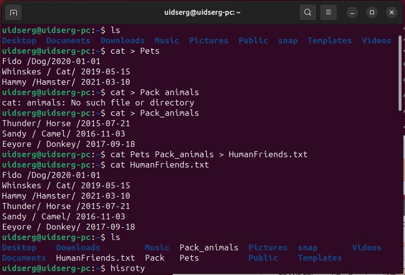
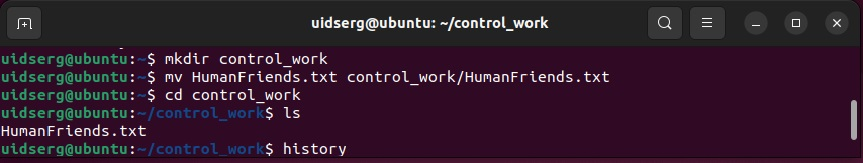
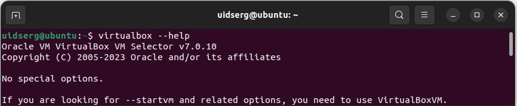
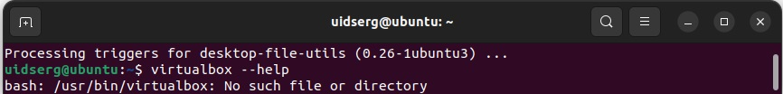
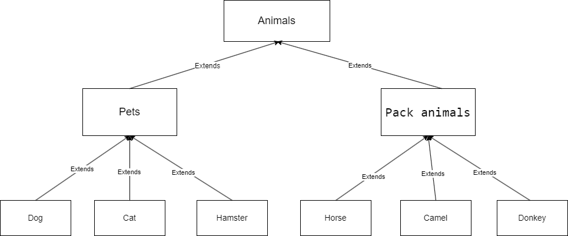

## Итоговая контрольная работа

Информация о проекте

Необходимо организовать систему учета для питомника в котором живут домашние и Pack animals.

Как сдавать проект

Для сдачи проекта необходимо создать отдельный общедоступный репозиторий(Github, gitlub, или Bitbucket). Разработку вести в этом репозитории, использовать пул реквесты на изменения. Программа должна запускаться и работать, ошибок при выполнении программы быть не должно. Программа, может использоваться в различных системах, поэтому необходимо разработать класс в виде конструктора

> Задание

Операционные системы и виртуализация (Linux)

1. Использование команды cat в Linux

- Создать два текстовых файла: "Pets"(Домашние животные) и "Pack animals"(вьючные животные), используя команду `cat` в терминале Linux. В первом файле перечислить собак, кошек и хомяков. Во втором — лошадей, верблюдов и ослов.

- Объединить содержимое этих двух файлов в один и просмотреть его содержимое.

- Переименовать получившийся файл в "Human Friends".

Пример конечного вывода после команды “ls” :

Desktop Documents Downloads HumanFriends.txt Music PackAnimals.txt Pets.txt Pictures Videos

        1  cat > Pets.txt
        2  cat > PackAnimals.txt
        3  cat Pets.txt PackAnimals.txt > HumanFriends.txt
        4  cat HumanFriends.txt 
        5  ls
        6  history

2. Работа с директориями в Linux

- Создать новую директорию и переместить туда файл "Human Friends".

        7  mkdir control_work
        8  mv HumanFriends.txt control_work/HumanFriends.txt
        9  cd control_work
        10  ls
        11  history

3. Работа с MySQL в Linux. “Установить MySQL на вашу вычислительную машину ”

- Подключить дополнительный репозиторий MySQL и установить один из пакетов из этого репозитория.    
    
        12  sudo apt install nginx
        13  sudo apt install curl
        14  curl localhost
        15  sudo apt install mysql-server
        16  sudo mysql_secure_installation
        17  sudo mysql
            mysql>SELECT * FROM mysql.user;
            mysql>ALTER USER 'root'@'localhost' IDENTIFIED WITH caching_sha2_password BY '12355321';
            mysql>exit
        18  sudo mysql -u root -p
            mysql>CREATE USER 'newuser'@'localhost' IDENTIFIED BY '12pass21';
            mysql>SELECT * FROM mysql.user;
            mysql>exit
        19  sudo mysql -u newuser -p
        20  history

4. Управление deb-пакетами

- Установить и затем удалить deb-пакет, используя команду `dpkg`.

        21  wget https://download.virtualbox.org/virtualbox/7.0.10/virtualbox-7.0_7.0.10-158379~Ubuntu~jammy_amd64.deb
        22  ll
        23  sudo dpkg -i virtualbox-7.0_7.0.10-158379~Ubuntu~jammy_amd64.deb
        24  virtualbox --help

        
        25  sudo dpkg -r virtualbox-7.0
        26  virtualbox --help

        27  history

5. История команд в терминале Ubuntu

- Сохранить и выложить историю ваших терминальных команд в Ubuntu.

В формате: Файла с ФИО, датой сдачи, номером группы(или потока)

   [История в файле](Damchenko_S.I.4589_05.12.23.txt "Дамченко С.И дата: 05/12/23 ГР4589")

## Объектно-ориентированное программирование 

6. Диаграмма классов
- Создать диаграмму классов с родительским классом "Животные", и двумя подклассами: "Pets" и "Pack animals".
В составы классов которых в случае Pets войдут классы: собаки, кошки, хомяки, а в класс Pack animals войдут: Лошади, верблюды и ослы).
Каждый тип животных будет характеризоваться (например, имена, даты рождения, выполняемые команды и т.д)
Диаграмму можно нарисовать в любом редакторе, такими как Lucidchart, Draw.io, Microsoft Visio и других.

7. Работа с MySQL (Задача выполняется в случае успешного выполнения задачи “Работа с MySQL в Linux. “Установить MySQL на вашу машину”

7.1. После создания диаграммы классов в 6 пункте, в 7 пункте база данных "Human Friends" должна быть структурирована в соответствии с этой диаграммой. Например, можно создать таблицы, которые будут соответствовать классам "Pets" и "Pack animals", и в этих таблицах будут поля, которые характеризуют каждый тип животных (например, имена, даты рождения, выполняемые команды и т.д.). 

7.2   - В ранее подключенном MySQL создать базу данных с названием "Human Friends".
   - Создать таблицы, соответствующие иерархии из вашей диаграммы классов.
   - Заполнить таблицы данными о животных, их командах и датами рождения.
   - Удалить записи о верблюдах и объединить таблицы лошадей и ослов.
   - Создать новую таблицу для животных в возрасте от 1 до 3 лет и вычислить их возраст с точностью до месяца.
   - Объединить все созданные таблицы в одну, сохраняя информацию о принадлежности к исходным таблицам.
<table>
    <thead>
        <tr>
            <th>id</th>
            <th>Name</th>
            <th>Type</th>
            <th>birthdate</th>
            <th>Commands</th>
        </tr>
    </thead>
    <tbody>
        <tr>
            <td align="center">1</td>
            <td align="center">Fido</td>
            <td align="center">Dog</td>
            <td align="center">2020-01-01</td>
            <td align="left">Sit, Stay, Fetch</td>
        </tr>
        <tr>
            <td align="center">2</td>
            <td align="center">Whiskers</td>
            <td align="center">Cat</td>
            <td align="center">2019-05-15</td>
            <td align="left">Sit, Pounce</td>
        </tr>
        <tr>
            <td align="center">3</td>
            <td align="center">Hammy</td>
            <td align="center">Hamster</td>
            <td align="center">2021-03-10</td>
            <td align="left">Roll, Hide</td>
        </tr>
        <tr>
            <td align="center">4</td>
            <td align="center">Buddy</td>
            <td align="center">Dog</td>
            <td align="center">2018-12-10</td>
            <td align="left">Sit, Paw, Bark</td>
        </tr>
    </tbody>
</table>
и тд., полная таблица в задании.

### 8. ООП и Java

- Создать иерархию классов в Java, который будет повторять диаграмму классов созданную в задаче 6(Диаграмма классов) .

9. Программа-реестр домашних животных
- Написать программу на Java, которая будет имитировать реестр домашних животных. 
Должен быть реализован следующий функционал:
    
9.1. Добавление нового животного
- Реализовать функциональность для добавления новых животных в реестр.       
 Животное должно определяться в правильный класс (например, "собака", "кошка", "хомяк" и т.д.)

9.2. Список команд животного
- Вывести список команд, которые может выполнять добавленное животное (например, "сидеть", "лежать").
        
9.3. Обучение новым командам
- Добавить возможность обучать животных новым командам.

9.4 Вывести список животных по дате рождения
9.5. Навигация по меню
- Реализовать консольный пользовательский интерфейс с меню для навигации между вышеуказанными функциями.
10. Счетчик животных
Создать механизм, который позволяет вывести на экран общее количество созданных животных любого типа (Как домашних, так и вьючных), то есть при создании каждого нового животного счетчик увеличивается на “1”. 
