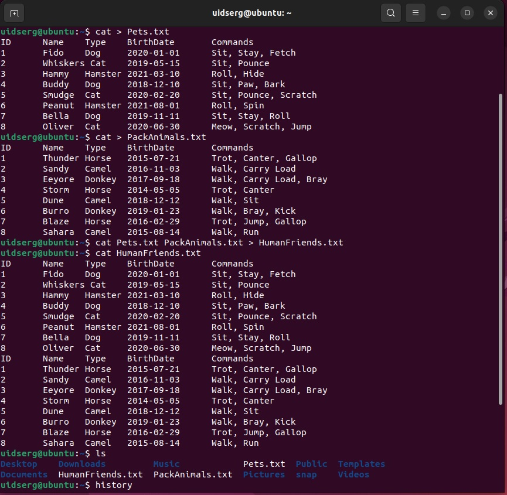

## Итоговая контрольная работа

Информация о проекте

Необходимо организовать систему учета для питомника в котором живут домашние и Pack animals.

Как сдавать проект

Для сдачи проекта необходимо создать отдельный общедоступный репозиторий(Github, gitlub, или Bitbucket). Разработку вести в этом репозитории, использовать пул реквесты на изменения. Программа должна запускаться и работать, ошибок при выполнении программы быть не должно. Программа, может использоваться в различных системах, поэтому необходимо разработать класс в виде конструктора

> Задание

Операционные системы и виртуализация (Linux)

1. Использование команды cat в Linux

- Создать два текстовых файла: "Pets"(Домашние животные) и "Pack animals"(вьючные животные), используя команду `cat` в терминале Linux. В первом файле перечислить собак, кошек и хомяков. Во втором — лошадей, верблюдов и ослов.

- Объединить содержимое этих двух файлов в один и просмотреть его содержимое.

- Переименовать получившийся файл в "Human Friends".

Пример конечного вывода после команды “ls” :

Desktop Documents Downloads HumanFriends.txt Music PackAnimals.txt Pets.txt Pictures Videos

        1  cat > Pets.txt
        2  cat > PackAnimals.txt
        3  cat Pets.txt PackAnimals.txt > HumanFriends.txt
        4  cat HumanFriends.txt 
        5  ls
        6  history

2. Работа с директориями в Linux

- Создать новую директорию и переместить туда файл "Human Friends".

        7  mkdir control_work
        8  mv HumanFriends.txt control_work/HumanFriends.txt
        9  cd control_work
        10  ls
        11  history

3. Работа с MySQL в Linux. “Установить MySQL на вашу вычислительную машину ”

- Подключить дополнительный репозиторий MySQL и установить один из пакетов из этого репозитория.    
    
        12  sudo apt install nginx
        13  sudo apt install curl
        14  curl localhost
        15  sudo apt install mysql-server
        16  sudo mysql_secure_installation
        17  sudo mysql
            mysql>SELECT * FROM mysql.user;
            mysql>ALTER USER 'root'@'localhost' IDENTIFIED WITH caching_sha2_password BY '12355321';
            mysql>exit
        18  sudo mysql -u root -p
            mysql>CREATE USER 'newuser'@'localhost' IDENTIFIED BY '12pass21';
            mysql>SELECT * FROM mysql.user;
            mysql>exit
        19  sudo mysql -u newuser -p
        20  history

4. Управление deb-пакетами

- Установить и затем удалить deb-пакет, используя команду `dpkg`.

        21  wget https://download.virtualbox.org/virtualbox/7.0.10/virtualbox-7.0_7.0.10-158379~Ubuntu~jammy_amd64.deb
        22  ll
        23  sudo dpkg -i virtualbox-7.0_7.0.10-158379~Ubuntu~jammy_amd64.deb
        24  virtualbox --help

        
        25  sudo dpkg -r virtualbox-7.0
        26  virtualbox --help

        27  history

5. История команд в терминале Ubuntu

- Сохранить и выложить историю ваших терминальных команд в Ubuntu.

В формате: Файла с ФИО, датой сдачи, номером группы(или потока)

   [История в файле](Damchenko_S.I.4589_05.12.23.txt "Дамченко С.И дата: 05/12/23 ГР4589")